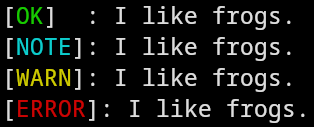

# cprint
`cprint`, the highlight function of Cerbose, allows you to output highly configurable tagged text to the console. Here is a deep overview of how to use it!

`cprint` is defined in Cerbose as:
```python
def cprint(tag, text, *, text_colour="normal", subtag=None, timestamp=False, log_file=None, as_string=False)
```

This means that type and text are the first two required arguments, and the rest are optional keyword arguments.
`type` defines the "tag" the output uses.  

Here is an output of text from Cerbose (examples/test.py)  
  
You should be able to see the parts in brackets. Those are tags.  
Assuming you are using the default configuration, there are 14 of them. That number varies by your configuration, but you will always have at least 1 (if you don't want errors, that is).

Here is a table showing the default configurations of the tags in cprint:

| Input | Text | Colour |
| --- | --- | --- |
| `'none'`  | `NONE`  | `'white'`     |
| `'ok'`    | `OK`    | `'green'`     |
| `'note'`  | `NOTE`  | `'cyan'`      |
| `'warn'`  | `WARN`  | `'yellow'`    |
| `'error'` | `ERROR` | `'red'`       |
| `'debug'` | `DEBUG` | `'magenta'`   |
| `'info'`  | `INFO`  | `'cyan'`      |
| `'query'` | `QUERY` | `'cyan'`      |
| `'input'` | `INPUT` | `'lightblue'` |
| `'load'`  | `LOAD`  | `'red'`       |
| `'pause'` | `PAUSE` | `'yellow'`    |
| `'stat'`  | `STAT`  | `'magenta'`   |
| `'fatal'` | `FATAL` | `'red'`       |
| `'trace'` | `TRACE` | `'magenta'`   |
| `'proc'`  | `PROC`  | `'magenta'`   |

## Basic Usage
A cprint call, without any additional arguments, is formatted as:
```python
cprint(tag, text)
```

**Example:**
```python
cprint("ok", "I like frogs."
```
Assuming default configurations, the output would look like this:  
![`[OK]: I like frogs.`](assets/docs/c.png)

> See custom tag configuration in 5-9.md.

## Logging
Set the `log_file` argument to whatever file you want (e.g., `log_file="log.txt"`), and upon running the `cprint` function, that log file will be created if it doesn't already exist, and the message of the cprint call will be written to it. (assuming no errors occur).  
It will still print the output to the console unless you enable `as_string` (explained later).  
If you do not want logging, do not enter the `log_file` argument. It will default to `None`, which will disable logging.

## Text Colour
To set a text colour in a `cprint` call, add the `text_colour` argument, which should contain a string corresponding to a `COLOURS` colour (e.g., `text_colour="red"`).  
The `text_colour` argument defaults to `"normal"`.

## Subtags
Subtags are secondary tags that precede the primary tag in `cprint`.  
**Example:**  
Call:  
```python
cprint("ok", "Hello, world!", subtag="warn")
```
Assuming default configurations, this would be the output:  
![`[WARN][OK]: Hello, world!](assets/docs/d.png)

> This uses the same configuration as the primary tag.  
See custom tag configuration in 5-9.md.

## Timestamps
A timestamp is a timestamp that precedes both the subtag (if enabled) and primary tag.  
The time format for timestamps can be configured. See custom timestamp configuration in 5-9.md.  
**Example:**  
Call:
```python
cprint("ok", "Hello, world!", timestamp=True)
```
Assuming default configurations and that the time is 12:34:56, this would be the output:  
![`[12:34:56][OK]: Hello, world!](assets/docs/e.png)

## Output as String
There's not much to say about this flag; enabling it (`as_string=True`) just makes `cprint` return its result in raw text instead of outputting it to the console.

## Auto-Alignment
This isn't a flag; this is a built-in feature of `cprint`.  
In default configuration, tags will be different lengths. If there were no padding in text, it would look jittery and difficult to read.  
Every tag (+stagtype and timestamp) has a gap (of spaces) between the actual tag and the text divisor (by default, that is the colon in `[OK]:`, in between the tag and text). This is **padding**, and it exists to align the text of outputs with the rest of Cerbose's output.  
If a tag is longer in characters than any tag before, the padding will increase in length to accommodate it, and all outputs afterward will have that new length of padding.  
This would be true if not for "space repeat tolerance". Padding can get long over time, so whenever a length has repeated for a configurable amount of outputs (defaulted to 5), it will lower to the length of the next smaller tag, whether that be one character or 79.  
To better understand this, here is an example (in raw codeblock, its fine):
```plaintext
[OK]: This is a short tag. Padding will soon need to increase.
[INFO]: This tag is longer than the previously outputted tag. Watch what happens when something shorter is outputted.
[OK]  : The gap between the tag and text divisor (:) has increased to align the text!
[DEBUG][FATAL]: This tag is very long.
[WARN]        : This gap continues to accommodate the longest tag.
[INFO]        : Watch what happens after this length has repeated five times.
[OK]          : ...
[OK]          : ...
[OK]          : ...
[WARN]: The padding (official name of gap) has now reset to the next shortest tag's length!
[OK]  : Continuing tags will use this length until it gets to reset again.
[NOTE]: You can always configure how many times a width has to repeat for that to happen.
[INFO]: See config.md for that info.
```

See space repeat tolerance configuration in config.md.

# mprint
`mprint` is functionally the exact same as cprint, except it supports multiline output. Here is a raw codeblock showcase of an output:
```plaintext
[NONE]: Hello.
      : I like frogs.
      : I hope you like them too. :)
```
It has the same arguments as `cprint`. Use `\n` to distinguish lines.
